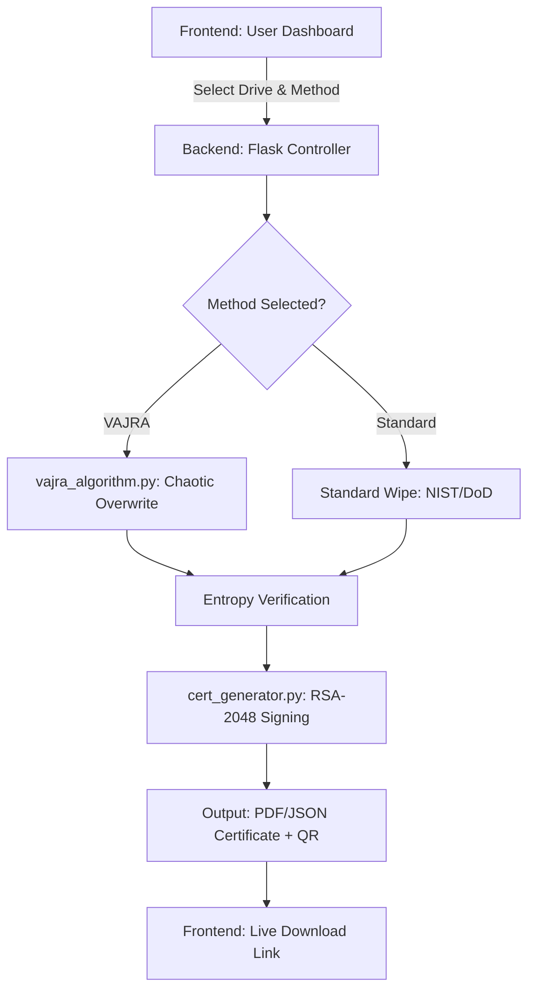

# 🔐 SecureWipe Pro
### India's First Indigenous Secure Data Sanitization Platform


---

> Built by **Team TechnoGreen** · BMIT Solapur · Presented at Uddyam Idea Hackathon 2026, PAH Solapur University
---

## 📚 Table of Contents

- [The VAJRA Algorithm](#-the-vajra-algorithm)
- [Comparison Table](#-comparison-vajra-vs-standard-methods)
- [Features](#-features)
- [Quick Start](#-quick-start)
- [Prerequisites](#-prerequisites--installation)
- [Standards Implemented](#-standards-implemented)
- [Tech Stack](#-tech-stack)
- [Project Structure](#-project-structure)
- [System Architecture](#-how-it-works-system-architecture)
- [How VAJRA Works](#-how-vajra-works-technical)
- [Mathematical Model](#-mathematical-model)
- [Certificate](#-certificate-sample)
- [Recognition](#-recognition)
- [Roadmap](#-roadmap--future-enhancements)
- [Disclaimer](#-disclaimer)
- [License](#-license)
---

## 🔍 About

**SecureWipe Pro** is an open-source, hardware-level data sanitization platform built in Python and Flask.  
It goes beyond simple file deletion — permanently destroying data at the bit level on HDDs, SSDs, NVMe, and USB drives,  
making forensic recovery computationally infeasible.
---

## 🧠 The VAJRA Algorithm

**VAJRA** — *Verified Adaptive Junk-data Removal Algorithm* — is an indigenously designed data sanitization algorithm at the core of SecureWipe Pro.

Unlike standard wipe methods, VAJRA uses **Logistic Map chaos theory** to generate unpredictable, non-repeating overwrite patterns, combined with **Shannon Entropy verification** to mathematically confirm that all original data has been destroyed.
```
Standard wiping:   0x00 → 0xFF → 0x00  (predictable, reversible)
VAJRA wiping:      chaos-generated patterns → entropy verified → certificate issued
```
**Why it matters:** Predictable patterns can potentially be reversed with forensic tools. VAJRA's chaotic overwrite patterns make data recovery computationally infeasible.
---

## 📊 Comparison: VAJRA vs. Standard Methods

| Method | Pattern Type | Recoverability | Verification |
| :--- | :--- | :--- | :--- |
| **Zero Fill** | Static (0x00) | Possible (Magnetic Trace) | None |
| **DoD 5220.22-M** | Fixed Patterns | Difficult | Bit-level only |
| **VAJRA (Ours)** | **Chaotic (Logistic Map)** | **Infeasible** | **Shannon Entropy** |

> **Key Advantage:** Standard methods use predictable patterns. VAJRA uses mathematical chaos — even if a forensic tool knows the algorithm, it cannot predict the overwrite pattern without the unique hardware-derived seed.
---

## ✨ Features

| Feature | Description | Status |
|---|---|---|
| VAJRA Algorithm | Chaos-theory based wipe with entropy verification | ✅ |
| Drive Detection | Real drives + Demo mode (safe testing) | ✅ |
| Wipe Standards | Zero-fill, DoD 3-pass, DoD 7-pass, NIST SP 800-88, Crypto Erasure | ✅ |
| Live Progress | Real-time progress bar via Server-Sent Events (SSE) | ✅ |
| PDF Certificate | Tamper-proof wipe certificate via ReportLab | ✅ |
| JSON Certificate | Machine-readable certificate for system integration | ✅ |
| Digital Signature | RSA-2048 / SHA-256 / PSS signing | ✅ |
| QR Verification | QR code for instant third-party certificate verification | ✅ |
| Certificate Verify | Upload & verify any previously issued certificate | ✅ |
---

## 🚀 Quick Start

```bash
# 1. Clone the repository
git clone https://github.com/Shivshettianiket/securewipe-pro.git
cd securewipe-pro

# 2. Install dependencies
pip install -r requirements.txt

# 3. Run the app
python app.py

# 4. Open in browser
# http://localhost:5000
```
> ⚠️ **Demo Mode Available** — You can test all features without connecting a real drive. No data is at risk.
---

## 📋 Prerequisites & Installation

### 1. System Requirements

- **Python 3.8+**: Ensure Python is added to your PATH.
- **Administrator/Sudo Privileges**: Required for low-level drive access and bit-writing.
- **Internet Connection**: Needed for QR code generation and live certificate verification.
### 2. Required Libraries

```bash
pip install flask cryptography reportlab qrcode[pil]
```
---

## 🛡️ Standards Implemented

| Standard | Method | Description |
|---|---|---|
| NIST SP 800-88 | Clear + Purge | US Government data sanitization guideline |
| DoD 5220.22-M | 3-pass & 7-pass | US Department of Defense standard |
| Cryptographic Erasure | Random pattern | Key destruction for encrypted drives |
| **VAJRA** | Chaos + Entropy | Indigenous algorithm (our innovation) |
---

## 🏗️ Tech Stack

- **Backend:** Python, Flask
- **Crypto:** RSA-2048, SHA-256, PSS (via `cryptography` library)
- **Certificates:** ReportLab (PDF), JSON
- **Algorithm:** Logistic Map (chaos theory), Shannon Entropy
- **Frontend:** HTML/CSS/JS, SSE for live updates
- **Deployment:** Procfile (Heroku-compatible)
- **Frontend:** HTML/CSS/JS, SSE for live updates
- **Deployment:** Procfile (Heroku-compatible)
  
> 📦 The `certs/` folder is gitignored — certificates are generated locally on each wipe operation.
---

## ⚙️ How it Works: System Architecture

The user selects a drive and wipe method from the dashboard. The Flask backend routes the request to either the VAJRA engine or a standard wipe module. After wiping, entropy is verified and a signed certificate is generated and returned to the user.

> 🔄 **Live Progress:** Wipe progress is streamed to the frontend in real-time using **Server-Sent Events (SSE)** — no page refresh needed.
---

## 🔬 How VAJRA Works (Technical)

```python
# Simplified overview of VAJRA Algorithm
def vajra_wipe(device):
    x = seed_from_device_metadata()    # Unique seed per device

    for pass in range(passes):
        for block in device.blocks:
            x = logistic_map(x)        # Chaotic, non-repeating value
            write(block, x)            # Overwrite with chaos-generated byte

    entropy = shannon_entropy(device)  # Verify randomness of written data
    assert entropy > THRESHOLD         # Confirm destruction
    issue_certificate(device, entropy) # Tamper-proof proof of wipe
```
The Logistic Map equation `x_{n+1} = r * x_n * (1 - x_n)` at r ≈ 3.99 produces chaotic, sensitive-to-initial-conditions output — making each wipe pattern unique and forensically irreversible.
---

## 📐 Mathematical Model

The VAJRA algorithm's chaos engine is defined by the iterative function:

$$x_{n+1} = r \cdot x_n(1 - x_n)$$

To ensure maximum aperiodicity (chaos), the system is locked at a growth rate of $r \approx 3.99$, ensuring generated overwrite patterns never repeat, even across multiple passes.

Shannon Entropy is calculated after each wipe pass. A score close to **8.0 bits/byte** confirms maximum randomness, mathematically proving the original data has been destroyed and cannot be reconstructed.
---

## 📜 Certificate Sample

After every wipe, SecureWipe Pro issues a **digitally signed certificate** containing:

- Device serial number & metadata
- Wipe standard used
- Shannon entropy score (proof of randomness)
- RSA-2048 digital signature
- QR code for instant online verification
Certificates are issued in two formats:

| Format | Use Case |
|---|---|
